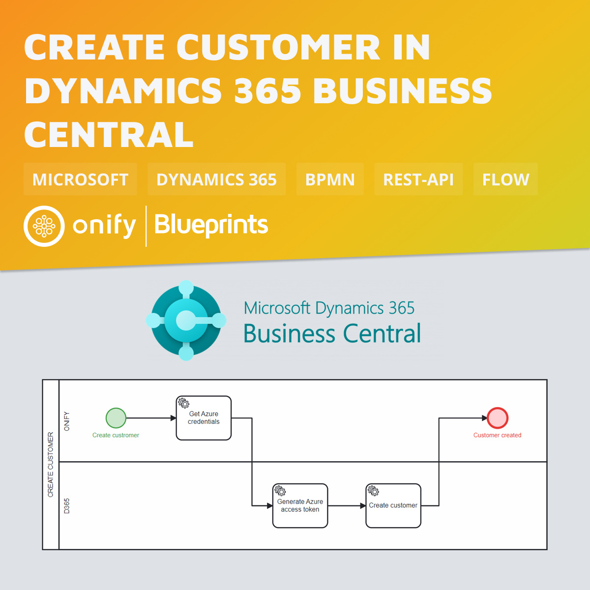

# Onify Blueprint: Create customer in Dynamics 365 Business Central

[Dynamics 365 Business Central](https://) ...

## Requirements

* [Onify Hub](https://github.com/onify/install)
* [Dynamics 365 Business Central](https://dynamics.microsoft.com/business-central/overview/)

## Included

* 1 x Flow

## Setup

### Settings

...

## Support

* Community/forum: https://support.onify.co/discuss
* Documentation: https://support.onify.co/docs
* Support and SLA: https://support.onify.co/docs/get-support

## License

This project is licensed under the MIT License - see the [LICENSE](LICENSE) file for details.
